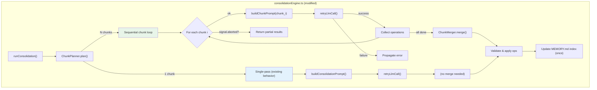

# Design Document: Batch Consolidation

## Overview

The consolidation engine currently builds a single LLM prompt containing all memory files and all session files. When the memory set grows large (57+ files, 48+ sessions), the prompt can exceed 90K characters, causing Bedrock API timeouts. This feature adds chunk-based processing to split large consolidation passes into smaller prompts that fit within LLM context limits, while preserving single-pass behavior when content is small enough.

Three new components are introduced:

1. **ChunkPlanner** (`src/consolidation/chunkPlanner.ts`) — partitions memory files into chunks based on `maxPromptChars` and `maxFilesPerBatch`, keeping all session files in every chunk.
2. **ChunkMerger** (`src/consolidation/chunkMerger.ts`) — reconciles file operations from multiple chunk LLM calls using last-chunk-wins semantics for conflicts.
3. **Modified consolidation engine** — orchestrates sequential chunk execution with abort support, delegates to ChunkPlanner and ChunkMerger, and updates the index once after all chunks complete.

The prompt builder gains a chunk-aware mode: each chunk prompt includes the full memory manifest and all sessions, but only the memory file contents assigned to that chunk, plus a chunk context header.

Two new config fields (`maxPromptChars`, `maxFilesPerBatch`) control chunking thresholds. The `ConsolidationResult` type gains `chunksTotal` and `chunksCompleted` fields.

## Architecture



### Key Design Decisions

**Session files in every chunk**: The LLM needs full session context to make informed decisions about which memories to create, update, or delete. Sessions are typically much smaller than the accumulated memory set, so including them in every chunk is acceptable. The `maxPromptChars` budget accounts for session content.

**Last-chunk-wins for conflicts**: When multiple chunks produce operations on the same file path, the operation from the highest chunk index wins. This is simple, deterministic, and avoids complex merge logic. Later chunks see the same manifest context and can make equally informed decisions.

**Sequential execution**: Chunks are processed one at a time. Parallel execution would complicate error handling and conflict resolution without meaningful benefit (LLM calls are the bottleneck, and most providers rate-limit concurrent requests).

**Single index update**: The MEMORY.md index is updated exactly once after all chunks complete and their results are merged. This avoids intermediate index states that could confuse the LLM in later chunks.

## Components and Interfaces

### New Files

#### `src/consolidation/chunkPlanner.ts`

Partitions memory files into chunks respecting both `maxPromptChars` and `maxFilesPerBatch` limits.

```typescript
export interface ChunkPlan {
  chunks: Chunk[];
}

export interface Chunk {
  index: number;              // 0-based chunk index
  memoryFiles: MemoryHeader[]; // memory files assigned to this chunk
}

/**
 * Partition memory files into chunks.
 *
 * Algorithm:
 * 1. Compute fixed overhead: prompt template + session content + manifest
 * 2. For each memory file, estimate its prompt contribution (content + formatting)
 * 3. Greedily assign files to chunks, starting a new chunk when either:
 *    - Adding the next file would exceed maxPromptChars (accounting for overhead)
 *    - The chunk already has maxFilesPerBatch files
 * 4. If a single file exceeds the available budget, place it alone and truncate
 * 5. If total content fits in one chunk, return a single chunk (preserving existing behavior)
 *
 * @param memories - All memory file headers with content sizes
 * @param sessionContentSize - Total character count of all session content (included in every chunk)
 * @param manifestSize - Character count of the full memory manifest (included in every chunk)
 * @param maxPromptChars - Maximum prompt size per chunk
 * @param maxFilesPerBatch - Maximum memory files per chunk
 */
export function planChunks(
  memories: MemoryFileWithSize[],
  sessionContentSize: number,
  manifestSize: number,
  maxPromptChars: number,
  maxFilesPerBatch: number,
): ChunkPlan;

export interface MemoryFileWithSize {
  header: MemoryHeader;
  contentSize: number;  // character count of the file's content
}
```

#### `src/consolidation/chunkMerger.ts`

Reconciles file operations from multiple chunks into a single consistent set.

```typescript
export interface ChunkResult {
  chunkIndex: number;
  operations: FileOperation[];
}

/**
 * Merge operations from multiple chunks using last-chunk-wins semantics.
 *
 * For each file path that appears in multiple chunks, only the operation
 * from the highest chunk index is kept. Non-conflicting operations are
 * preserved in their original order (chunk order, then intra-chunk order).
 *
 * @param chunkResults - Operations from each chunk, ordered by chunk index
 * @returns Merged list of file operations
 */
export function mergeChunkResults(chunkResults: ChunkResult[]): FileOperation[];
```

### Modified Files

#### `src/types.ts` — Extended Types

```typescript
// Added to ConsolidationResult
export interface ConsolidationResult {
  // ... existing fields ...
  chunksTotal: number;       // total chunks planned
  chunksCompleted: number;   // chunks that completed LLM calls
}

// Added to MemconsolidateConfig
export interface MemconsolidateConfig {
  // ... existing fields ...
  maxPromptChars: number;      // default 60000, min 10000
  maxFilesPerBatch: number;    // default 30, min 1
}
```

#### `src/config.ts` — Extended Validation

- Add `max_prompt_chars` → `maxPromptChars` and `max_files_per_batch` → `maxFilesPerBatch` to `KEY_MAP`
- Add defaults: `maxPromptChars: 60_000`, `maxFilesPerBatch: 30`
- Add validation: `maxPromptChars >= 10_000`, `maxFilesPerBatch >= 1`

#### `src/consolidation/consolidationEngine.ts` — Chunk-Aware Flow

The `runConsolidation` function is modified:

1. Scan memory files and read their content sizes
2. Call `planChunks()` to get the chunk plan
3. If single chunk → existing single-pass behavior (no behavioral change)
4. If multiple chunks → loop sequentially:
   - Check abort signal before each chunk
   - Build chunk prompt via `buildChunkPrompt()`
   - Call `retryLlmCall()` for each chunk
   - Collect operations per chunk
   - Log chunk index, total, and prompt size
5. Call `mergeChunkResults()` on collected operations
6. Validate and apply merged operations (existing logic)
7. Update index once from merged operations

#### `src/consolidation/promptBuilder.ts` — Chunk-Aware Prompt Building

New exported function:

```typescript
/**
 * Build a prompt for a single chunk of a multi-chunk consolidation pass.
 *
 * Includes:
 * - Full memory manifest (all files, not just this chunk's)
 * - Full MEMORY.md index
 * - Only the memory file contents assigned to this chunk
 * - All session file contents (truncated per maxSessionContentChars)
 * - Chunk context header: "Processing chunk X of Y. This chunk contains: [file list]"
 */
export async function buildChunkPrompt(
  memoryDir: string,
  sessionDir: string,
  chunkMemories: MemoryHeader[],  // only this chunk's memory files
  allMemories: MemoryHeader[],     // full manifest for context
  chunkIndex: number,
  chunksTotal: number,
  config?: MemconsolidateConfig,
): Promise<string>;
```

The existing `buildConsolidationPrompt` remains unchanged for single-chunk passes.

## Data Models

### ChunkPlan

```typescript
interface ChunkPlan {
  chunks: Chunk[];  // 1+ chunks; exactly 1 when content fits in a single pass
}

interface Chunk {
  index: number;              // 0-based
  memoryFiles: MemoryHeader[]; // memory files assigned to this chunk
}
```

### ChunkResult

```typescript
interface ChunkResult {
  chunkIndex: number;          // matches Chunk.index
  operations: FileOperation[]; // raw operations from the LLM for this chunk
}
```

### Extended ConsolidationResult

```typescript
interface ConsolidationResult {
  filesCreated: string[];
  filesUpdated: string[];
  filesDeleted: string[];
  indexUpdated: boolean;
  truncationApplied: boolean;
  durationMs: number;
  promptLength: number;          // sum of all chunk prompt lengths
  operationsRequested: number;   // sum across all chunks
  operationsApplied: number;     // after merge + validation
  operationsSkipped: number;     // after merge + validation
  chunksTotal: number;           // NEW: total chunks planned
  chunksCompleted: number;       // NEW: chunks that completed LLM calls
}
```

### Extended MemconsolidateConfig

```typescript
interface MemconsolidateConfig {
  // ... existing fields ...
  maxPromptChars: number;      // TOML: max_prompt_chars, default 60000, min 10000
  maxFilesPerBatch: number;    // TOML: max_files_per_batch, default 30, min 1
}
```

### Merge Semantics

For a given file path appearing in chunks `i` and `j` where `j > i`:

| Chunk i op | Chunk j op | Merged result |
|-----------|-----------|---------------|
| create    | update    | create (with chunk j content) |
| create    | delete    | delete |
| update    | update    | update (with chunk j content) |
| update    | delete    | delete |
| delete    | create    | create |
| delete    | update    | update |

The rule is simple: the last chunk's operation wins entirely.


## Correctness Properties

*A property is a characteristic or behavior that should hold true across all valid executions of a system — essentially, a formal statement about what the system should do. Properties serve as the bridge between human-readable specifications and machine-verifiable correctness guarantees.*

### Property 1: Chunk size constraints

*For any* set of memory files with arbitrary content sizes, any valid `maxPromptChars` (≥ 10000), and any valid `maxFilesPerBatch` (≥ 1), every chunk produced by `planChunks` should have an estimated prompt size ≤ `maxPromptChars` and contain at most `maxFilesPerBatch` memory files.

**Validates: Requirements 1.1, 1.2**

### Property 2: Partition completeness

*For any* set of memory files, the chunks produced by `planChunks` should form a complete partition: the union of all chunk memory files equals the input set (no file omitted), and no file appears in more than one chunk.

**Validates: Requirements 1.5**

### Property 3: Single chunk when content fits

*For any* set of memory files where the total estimated prompt size is ≤ `maxPromptChars` and the file count is ≤ `maxFilesPerBatch`, `planChunks` should produce exactly one chunk containing all files.

**Validates: Requirements 1.3, 6.1, 6.2**

### Property 4: Invalid batch config rejected

*For any* numeric value less than 10000 provided as `maxPromptChars`, or any numeric value less than 1 provided as `maxFilesPerBatch`, `validateConfig` should throw an error with a descriptive message.

**Validates: Requirements 2.3, 2.4**

### Property 5: Merge correctness — last-chunk-wins with order preservation

*For any* list of `ChunkResult` objects, `mergeChunkResults` should produce a merged operation list where: (a) for each file path appearing in multiple chunks, only the operation from the highest chunk index is present; (b) non-conflicting operations appear in chunk-order then intra-chunk-order; and (c) every unique file path from the input appears exactly once in the output.

**Validates: Requirements 4.1, 4.2, 4.3, 4.4, 4.5**

### Property 6: Chunk prompt contains full shared context

*For any* non-empty set of memory files, index entries, and session files, every chunk prompt produced by `buildChunkPrompt` should contain: (a) the full memory manifest listing all memory file names, (b) the full MEMORY.md index content, and (c) all session file content (each truncated to `maxSessionContentChars`).

**Validates: Requirements 8.1, 8.2, 8.4, 1.4**

### Property 7: Chunk prompt content isolation

*For any* multi-chunk plan, each chunk prompt produced by `buildChunkPrompt` should contain the full content of every memory file assigned to that chunk, and should not contain the full content of any memory file assigned to a different chunk.

**Validates: Requirements 8.3**

### Property 8: Chunk prompt context header

*For any* chunk in a multi-chunk plan, the prompt produced by `buildChunkPrompt` should contain a context header that includes the chunk index, the total chunk count, and the names of the memory files included in that chunk.

**Validates: Requirements 8.5**

### Property 9: Result chunk metrics

*For any* consolidation pass, the returned `ConsolidationResult` should have `chunksTotal` equal to the number of planned chunks, and `chunksCompleted` ≤ `chunksTotal`. For a fully successful pass, `chunksCompleted` should equal `chunksTotal`.

**Validates: Requirements 7.1, 7.2**

### Property 10: Result aggregated metrics

*For any* multi-chunk consolidation pass, the returned `ConsolidationResult` should have `promptLength` equal to the sum of individual chunk prompt lengths, and `operationsRequested` equal to the sum of operations returned by each chunk's LLM call.

**Validates: Requirements 7.3, 7.4**

## Error Handling

### Chunk Planning Errors

- **Zero memory files**: `planChunks` returns a single empty chunk. The consolidation proceeds with one LLM call (the LLM may still produce operations based on session content alone).
- **Oversized single file**: If a memory file's content exceeds `maxPromptChars` minus fixed overhead, it is placed in its own chunk. The prompt builder truncates the file content to fit. Logged as `consolidation:oversized-file`.

### Chunk Execution Errors

- **LLM failure on chunk N**: After exhausting retries (existing `retryLlmCall` behavior), the engine stops processing remaining chunks. The error propagates to the caller. No file operations from any chunk are applied (fail-fast). `chunksCompleted` reflects how many chunks succeeded before the failure.
- **Abort signal between chunks**: Checked before each chunk's LLM call. If aborted, returns partial results with `chunksCompleted < chunksTotal`. No file operations are applied for incomplete passes.
- **Abort signal during LLM call**: Handled by existing `retryLlmCall` abort logic.

### Merge Errors

- **Empty operations from all chunks**: Valid state. The merge produces an empty operation list. The index is still updated to reflect current memory directory state.
- **Conflicting operations**: Resolved deterministically by last-chunk-wins. No error is raised.

### Validation Errors (unchanged)

- **Invalid paths, invalid frontmatter**: Same behavior as current single-pass — operations are skipped and counted in `operationsSkipped`. Applied per-operation after merge.

### Config Errors

- **maxPromptChars < 10000**: `validateConfig` throws with descriptive message.
- **maxFilesPerBatch < 1**: `validateConfig` throws with descriptive message.

## Testing Strategy

### Property-Based Testing

Property-based tests use [fast-check](https://github.com/dubzzz/fast-check) with a minimum of 100 iterations per property. Each test is tagged with a comment referencing the design property.

Key property tests:

1. **ChunkPlanner size constraints** (Property 1): Generate random `MemoryFileWithSize` arrays (varying count 0–100, content sizes 0–20000), random `maxPromptChars` (10000–100000), random `maxFilesPerBatch` (1–50). Verify every chunk respects both limits.
   ```typescript
   // Feature: batch-consolidation, Property 1: Chunk size constraints
   ```

2. **ChunkPlanner partition completeness** (Property 2): Same generators as above. Collect all memory files from all chunks, verify they form a set-equal partition of the input.
   ```typescript
   // Feature: batch-consolidation, Property 2: Partition completeness
   ```

3. **ChunkPlanner single chunk** (Property 3): Generate file sets that fit within limits. Verify exactly one chunk.
   ```typescript
   // Feature: batch-consolidation, Property 3: Single chunk when content fits
   ```

4. **Config validation rejection** (Property 4): Generate random numbers < 10000 for `maxPromptChars` and < 1 for `maxFilesPerBatch`. Verify `validateConfig` throws.
   ```typescript
   // Feature: batch-consolidation, Property 4: Invalid batch config rejected
   ```

5. **ChunkMerger correctness** (Property 5): Generate random `ChunkResult` arrays with overlapping and non-overlapping paths. Verify last-chunk-wins, order preservation, and completeness.
   ```typescript
   // Feature: batch-consolidation, Property 5: Merge correctness
   ```

6. **Chunk prompt shared context** (Property 6): Generate random memory headers, index entries, and session content. Build chunk prompts. Verify each contains full manifest, full index, and all sessions.
   ```typescript
   // Feature: batch-consolidation, Property 6: Chunk prompt shared context
   ```

7. **Chunk prompt content isolation** (Property 7): Generate multi-chunk plans with distinct file contents. Verify each chunk prompt contains only its assigned files' content.
   ```typescript
   // Feature: batch-consolidation, Property 7: Chunk prompt content isolation
   ```

8. **Chunk prompt context header** (Property 8): Generate random chunk configurations. Verify the prompt contains the chunk index, total, and file names.
   ```typescript
   // Feature: batch-consolidation, Property 8: Chunk prompt context header
   ```

9. **Result chunk metrics** (Property 9): Mock LLM backend, run consolidation with various file sets. Verify `chunksTotal` and `chunksCompleted` values.
   ```typescript
   // Feature: batch-consolidation, Property 9: Result chunk metrics
   ```

10. **Result aggregated metrics** (Property 10): Mock LLM to return known operation counts. Verify `promptLength` and `operationsRequested` are sums.
    ```typescript
    // Feature: batch-consolidation, Property 10: Result aggregated metrics
    ```

### Unit Testing

Unit tests complement property tests for specific examples and edge cases:

- **Config defaults** (Req 2.1, 2.2): Verify `maxPromptChars` defaults to 60000 and `maxFilesPerBatch` defaults to 30.
- **TOML key mapping** (Req 2.5): Verify `max_prompt_chars` and `max_files_per_batch` map correctly.
- **Single-chunk backward compatibility** (Req 6.1, 6.2, 6.3): Verify single-chunk pass makes exactly one LLM call and returns `chunksTotal: 1, chunksCompleted: 1`.
- **Abort between chunks** (Req 3.2): Mock LLM, abort after first chunk, verify partial results.
- **LLM failure stops processing** (Req 3.4): Mock LLM to fail on chunk 2, verify error propagation and `chunksCompleted: 1`.
- **Chunk logging** (Req 3.5, 7.5): Mock logger, verify log events contain chunk index, total, and prompt size.
- **Empty merge** (Req 5.3): Verify index is updated even when all chunks return empty operations.
- **Oversized file isolation** (Req 1.6): Create a file exceeding budget, verify it gets its own chunk.
- **Create-then-delete merge** (Req 4.3): Verify merge resolves to delete.
- **Delete-then-create merge** (Req 4.4): Verify merge resolves to create.

### Test Configuration

- **Library**: fast-check for property-based tests, vitest for unit tests
- **Iterations**: Minimum 100 per property test
- **LLM mocking**: All tests mock the `LlmBackend` interface — no real LLM calls
- **Filesystem**: Property tests for ChunkPlanner and ChunkMerger are pure-function tests (no filesystem). Prompt builder tests use isolated temp directories.
