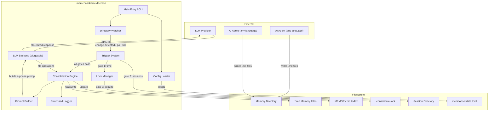
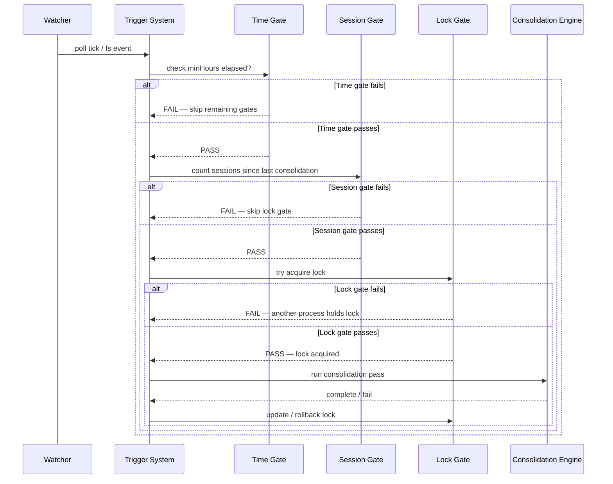
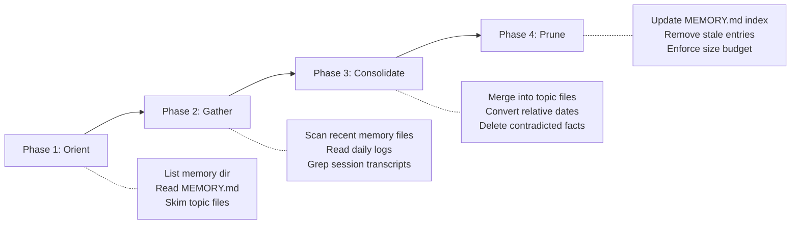
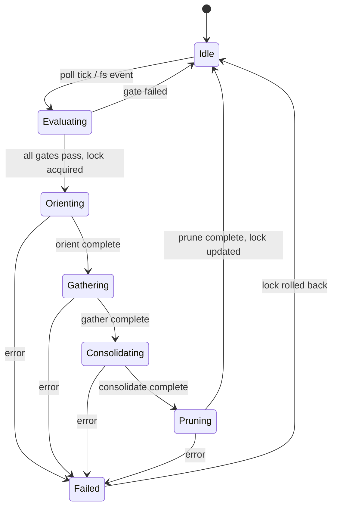

# Design Document — memconsolidate

## Overview

memconsolidate is a standalone Node.js/TypeScript daemon that watches a directory of markdown memory files and periodically consolidates them via a pluggable LLM backend. The daemon is filesystem-driven: any AI agent in any language can drop `.md` files into the watched directory, and the daemon handles deduplication, merging, date normalization, and index maintenance.

The core loop is:

1. Poll or watch the memory directory on a configurable interval
2. Evaluate a three-gate trigger: Time → Session count → Lock
3. If all gates pass, acquire the lock and run a four-phase consolidation pass (orient → gather → consolidate → prune)
4. Release/update the lock on completion; roll back on failure

The LLM backend is abstracted behind a simple interface so operators can swap providers (OpenAI, Anthropic, local models) via configuration.

### Key Design Decisions

| Decision | Rationale |
|---|---|
| TypeScript / Node.js | Matches reference implementation; strong async/fs ecosystem |
| Filesystem as interface | Language-agnostic — no SDK needed for agents |
| TOML config file | Human-readable, widely supported, good for daemon config |
| PID-based lock file | Simple, portable concurrency control without external deps |
| Structured JSON-lines logging | Machine-parseable, easy to pipe into log aggregators |
| Pluggable LLM via interface | Decouples consolidation logic from any specific provider |
| 4-phase prompt structure | The core IP — systematic orient/gather/consolidate/prune |

## Architecture

### High-Level System Diagram



### Process Flow — Consolidation Trigger



### Four-Phase Consolidation Flow



## Components and Interfaces

### Component Overview


```
src/
├── index.ts                  # CLI entry point, signal handling
├── config.ts                 # Config loading, validation, defaults
├── daemon.ts                 # Main loop: watcher + trigger orchestration
├── trigger/
│   ├── triggerSystem.ts      # Three-gate orchestrator
│   ├── timeGate.ts           # Time elapsed check
│   └── sessionGate.ts        # Session count check
├── lock/
│   └── consolidationLock.ts  # Lock file acquire/release/rollback
├── consolidation/
│   ├── consolidationEngine.ts # Orchestrates the 4-phase pass
│   └── promptBuilder.ts       # Builds the consolidation prompt string
├── llm/
│   ├── llmBackend.ts          # LLM backend interface definition
│   └── openaiBackend.ts       # Reference implementation (OpenAI-compatible)
├── memory/
│   ├── frontmatter.ts         # YAML frontmatter parse/serialize
│   ├── memoryScanner.ts       # Scan memory dir, return MemoryHeader[]
│   ├── memoryAge.ts           # Age computation, staleness caveats
│   ├── memoryTypes.ts         # Memory type enum + validation
│   └── indexManager.ts        # MEMORY.md read/write/truncate
├── logger.ts                  # Structured JSON-lines logger
└── types.ts                   # Shared type definitions
```

### 1. Config Loader (`config.ts`)

Reads and validates daemon configuration from a TOML or JSON file.

```typescript
interface MemconsolidateConfig {
  memoryDirectory: string;          // Path to memory dir (default: "./memory")
  sessionDirectory: string;         // Path to session transcripts (default: "./sessions")
  minHours: number;                 // Time gate threshold (default: 24)
  minSessions: number;              // Session gate threshold (default: 5)
  staleLockThresholdMs: number;     // Lock staleness (default: 3_600_000)
  maxIndexLines: number;            // Index line cap (default: 200)
  maxIndexBytes: number;            // Index byte cap (default: 25_000)
  llmBackend: string;               // Backend identifier (e.g., "openai")
  llmBackendOptions: Record<string, unknown>; // Backend-specific config (API key, model, etc.)
  pollIntervalMs: number;           // Watcher poll interval (default: 60_000)
}

function loadConfig(configPath?: string): MemconsolidateConfig;
function validateConfig(raw: unknown): MemconsolidateConfig; // throws on invalid
```

### 2. Trigger System (`trigger/triggerSystem.ts`)

Evaluates the three gates in cheapest-first order. Short-circuits on first failure.

```typescript
interface TriggerResult {
  triggered: boolean;
  failedGate?: 'time' | 'session' | 'lock';
  sessionCount?: number;
  priorMtime?: number;
}

function evaluateTrigger(
  config: MemconsolidateConfig,
  lastConsolidatedAt: number
): Promise<TriggerResult>;
```

### 3. Time Gate (`trigger/timeGate.ts`)

```typescript
function checkTimeGate(lastConsolidatedAt: number, minHours: number): boolean;
// Returns true if (Date.now() - lastConsolidatedAt) >= minHours * 3_600_000
```

### 4. Session Gate (`trigger/sessionGate.ts`)

```typescript
function checkSessionGate(
  sessionDirectory: string,
  lastConsolidatedAt: number,
  minSessions: number
): Promise<{ passed: boolean; count: number }>;
// Scans sessionDirectory for files with mtime > lastConsolidatedAt
```

### 5. Lock Manager (`lock/consolidationLock.ts`)

```typescript
const LOCK_FILENAME = '.consolidate-lock';

interface LockState {
  exists: boolean;
  holderPid: number | null;
  mtime: number;           // 0 if no lock file
  isStale: boolean;
  holderAlive: boolean;
}

function readLockState(memoryDir: string, staleLockThresholdMs: number): Promise<LockState>;
function tryAcquireLock(memoryDir: string, staleLockThresholdMs: number): Promise<{ acquired: boolean; priorMtime: number }>;
function releaseLock(memoryDir: string): Promise<void>;  // updates mtime to now (success case)
function rollbackLock(memoryDir: string, priorMtime: number): Promise<void>; // restores mtime on failure
```

Race detection: after writing PID, re-read the file. If PID doesn't match, yield (another process won the race).

### 6. Consolidation Engine (`consolidation/consolidationEngine.ts`)

Orchestrates the four phases by building a prompt, sending it to the LLM backend, and applying the returned file operations.

```typescript
interface ConsolidationResult {
  filesCreated: string[];
  filesUpdated: string[];
  filesDeleted: string[];
  indexUpdated: boolean;
  truncationApplied: boolean;
}

function runConsolidation(
  config: MemconsolidateConfig,
  backend: LlmBackend,
  signal: AbortSignal
): Promise<ConsolidationResult>;
```

### 7. Prompt Builder (`consolidation/promptBuilder.ts`)

Builds the self-contained 4-phase consolidation prompt from current memory state.

```typescript
function buildConsolidationPrompt(
  memoryDir: string,
  sessionDir: string,
  extraContext?: string
): Promise<string>;
```

The prompt instructs the LLM to:
- Phase 1 (Orient): List memory dir, read MEMORY.md, skim topic files
- Phase 2 (Gather): Scan daily logs, drifted memories, grep transcripts
- Phase 3 (Consolidate): Write/update memory files, convert relative→absolute dates, delete contradicted facts
- Phase 4 (Prune): Update MEMORY.md index, enforce size budget, demote verbose entries

### 8. LLM Backend Interface (`llm/llmBackend.ts`)

```typescript
interface FileOperation {
  op: 'create' | 'update' | 'delete';
  path: string;              // relative to memory dir
  content?: string;          // required for create/update
}

interface LlmResponse {
  operations: FileOperation[];
  reasoning?: string;        // optional LLM reasoning trace
}

interface LlmBackend {
  readonly name: string;
  initialize(options: Record<string, unknown>): Promise<void>;
  consolidate(prompt: string): Promise<LlmResponse>;
}
```

### 9. OpenAI-Compatible Reference Backend (`llm/openaiBackend.ts`)

```typescript
class OpenAIBackend implements LlmBackend {
  readonly name = 'openai';
  private client: OpenAIClient;
  private model: string;

  async initialize(options: Record<string, unknown>): Promise<void>;
  async consolidate(prompt: string): Promise<LlmResponse>;
}
```

Sends the prompt as a system message, parses the response into `FileOperation[]`. Uses structured output / function calling to get reliable JSON back.

### 10. Frontmatter Parser (`memory/frontmatter.ts`)

```typescript
interface MemoryFrontmatter {
  name: string;
  description: string;
  type: MemoryType | null;   // null if unrecognized type
}

interface ParsedMemoryFile {
  frontmatter: MemoryFrontmatter;
  body: string;
}

function parseFrontmatter(raw: string): ParsedMemoryFile | null;  // null on malformed
function serializeFrontmatter(fm: MemoryFrontmatter, body: string): string;
```

Frontmatter regex: `/^---\s*\n([\s\S]*?)---\s*\n?/`

### 11. Memory Scanner (`memory/memoryScanner.ts`)

```typescript
interface MemoryHeader {
  path: string;
  name: string;
  description: string;
  type: MemoryType | null;
  mtimeMs: number;
}

function scanMemoryFiles(
  memoryDir: string,
  signal?: AbortSignal
): Promise<MemoryHeader[]>;
// Returns sorted newest-first, capped at 200

function formatMemoryManifest(memories: MemoryHeader[]): string;
// One-line-per-file text format for prompt inclusion
```

### 12. Memory Age (`memory/memoryAge.ts`)

```typescript
function memoryAgeDays(mtimeMs: number): number;
// Math.floor((Date.now() - mtimeMs) / 86_400_000)

function memoryAge(mtimeMs: number): string;
// "today" | "yesterday" | "N days ago"

function memoryFreshnessText(mtimeMs: number): string;
// Staleness caveat for memories > 1 day old

function memoryFreshnessNote(mtimeMs: number): string;
// Wrapped in <system-reminder> tags
```

### 13. Memory Types (`memory/memoryTypes.ts`)

```typescript
type MemoryType = 'user' | 'feedback' | 'project' | 'reference';

const MEMORY_TYPES: readonly MemoryType[] = ['user', 'feedback', 'project', 'reference'];

function parseMemoryType(raw: string): MemoryType | null;
// Returns null for unrecognized types
```

### 14. Index Manager (`memory/indexManager.ts`)

```typescript
const ENTRYPOINT_NAME = 'MEMORY.md';
const MAX_ENTRYPOINT_LINES = 200;
const MAX_ENTRYPOINT_BYTES = 25_000;

interface IndexEntry {
  title: string;
  file: string;
  description: string;
}

function readIndex(memoryDir: string): Promise<IndexEntry[]>;
function writeIndex(memoryDir: string, entries: IndexEntry[]): Promise<void>;
function truncateIndexContent(raw: string, maxLines: number, maxBytes: number): { content: string; truncated: boolean; reason?: 'lines' | 'bytes' };
function formatIndexEntry(entry: IndexEntry): string;
// "- [Title](file.md) — one-line description"
```

### 15. Daemon (`daemon.ts`)

```typescript
class MemconsolidateDaemon {
  constructor(config: MemconsolidateConfig);
  start(): Promise<void>;       // begin watching + initial gate check
  stop(): Promise<void>;        // graceful shutdown
  runOnce(): Promise<void>;     // single trigger evaluation + consolidation if gates pass
}
```

### 16. Logger (`logger.ts`)

```typescript
interface LogEntry {
  timestamp: string;
  level: 'info' | 'warn' | 'error';
  event: string;
  data?: Record<string, unknown>;
}

function log(level: LogEntry['level'], event: string, data?: Record<string, unknown>): void;
// Writes JSON line to stdout
```

## Data Models

### Memory File On-Disk Format

```markdown
---
name: "Project Architecture"
description: "Key architectural decisions and patterns for the project"
type: project
---

## Current Architecture

The project uses a monorepo structure with...

## Key Decisions

- Chose PostgreSQL over MongoDB because...
```

### Index File (MEMORY.md) Format

```markdown
- [Project Architecture](project-architecture.md) — Key architectural decisions and patterns
- [User Preferences](user-preferences.md) — Editor settings, workflow preferences
- [API Feedback](api-feedback.md) — Issues and improvements noted during API work
```

Each line: `- [Title](file.md) — description` (max 150 chars per line).

### Lock File (`.consolidate-lock`) Format

```
12345
```

Single line containing the holder's PID. The file's mtime represents the last consolidation timestamp.

### Configuration File (`memconsolidate.toml`)

```toml
memory_directory = "./memory"
session_directory = "./sessions"
min_hours = 24
min_sessions = 5
stale_lock_threshold_ms = 3600000
max_index_lines = 200
max_index_bytes = 25000
poll_interval_ms = 60000

[llm_backend]
name = "openai"
api_key = "${OPENAI_API_KEY}"   # env var substitution
model = "gpt-4o"
```

### LLM Response Schema

```typescript
// The LLM returns a JSON object matching this schema:
{
  "operations": [
    { "op": "create", "path": "new-topic.md", "content": "---\nname: ...\n---\n..." },
    { "op": "update", "path": "existing-topic.md", "content": "---\nname: ...\n---\n..." },
    { "op": "delete", "path": "obsolete-topic.md" }
  ],
  "reasoning": "Merged duplicate entries about deployment..."
}
```

### State Transitions — Consolidation Pass



