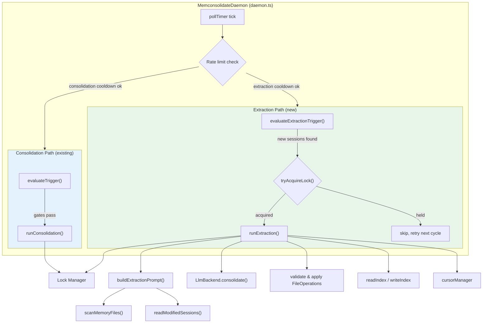

# Design Document: Memory Extraction

## Overview

Memory extraction adds a second operational mode to the agent-memory-daemon. While consolidation reorganizes and prunes existing memory files on a slow cadence (hours/days), extraction watches for new session content and runs an LLM pass to identify facts, decisions, preferences, and error corrections worth remembering — writing them as individual memory files.

The design maximizes reuse of existing infrastructure: the same LLM backends, lock manager, index manager, frontmatter module, memory scanner, and structured logger. New code is limited to four concerns:

1. **Extraction Engine** (`src/extraction/extractionEngine.ts`) — orchestrates the extraction pass: build prompt → call LLM → validate & apply operations → update index → advance cursor
2. **Extraction Prompt Builder** (`src/extraction/extractionPromptBuilder.ts`) — builds the self-contained extraction prompt with memory manifest, session content, and LLM instructions
3. **Extraction Trigger** (`src/extraction/extractionTrigger.ts`) — scans session files for modifications since the cursor and decides whether extraction should run
4. **Cursor Manager** (`src/extraction/cursorManager.ts`) — reads/writes the `.extraction-cursor` timestamp file

The daemon's polling loop is extended to evaluate extraction triggers alongside consolidation triggers, with mutual exclusion enforced via the shared PID-based lock.

## Architecture



### Mutual Exclusion

Both consolidation and extraction write to the memory directory. The existing PID-based lock (`consolidationLock.ts`) prevents concurrent writes. The daemon enforces mutual exclusion at the polling level:

- A boolean flag `extracting` (analogous to the existing `consolidating`) prevents overlapping operations.
- Before starting extraction, the daemon checks `this.consolidating`; before starting consolidation, it checks `this.extracting`.
- The lock is acquired before either operation and released/rolled-back after.

This is simpler than the Claude Code approach (which uses a forked agent with stashed contexts) because the daemon is single-threaded with a serial polling loop — only one operation can be in-flight at a time.

### Polling Loop Flow

Each `runOnce()` tick:

1. If `consolidating` or `extracting` → return (guard against re-entry)
2. Evaluate consolidation triggers (existing logic, unchanged)
3. If consolidation didn't run and `extractionEnabled` is true:
   a. Check extraction rate limit (`extractionIntervalMs`)
   b. Evaluate extraction trigger (scan sessions vs cursor)
   c. If triggered → acquire lock → `runExtraction()` → release/rollback lock → advance cursor

Consolidation takes priority: if both triggers fire on the same tick, consolidation runs first and extraction waits for the next cycle.

## Components and Interfaces

### New Files

#### `src/extraction/cursorManager.ts`

Manages the `.extraction-cursor` file — a plain text file containing a millisecond timestamp.

```typescript
// Read the cursor timestamp. Returns 0 if the file doesn't exist (first run).
export async function readExtractionCursor(memoryDir: string): Promise<number>;

// Write the cursor timestamp after a successful extraction.
export async function writeExtractionCursor(memoryDir: string, timestampMs: number): Promise<void>;
```

#### `src/extraction/extractionTrigger.ts`

Scans the session directory for files modified since the cursor.

```typescript
export interface ExtractionTriggerResult {
  triggered: boolean;
  modifiedFiles: string[];  // filenames of sessions modified since cursor
}

// Compare session file mtimes against the cursor timestamp.
export async function evaluateExtractionTrigger(
  sessionDir: string,
  cursorTimestamp: number,
): Promise<ExtractionTriggerResult>;
```

#### `src/extraction/extractionPromptBuilder.ts`

Builds the self-contained extraction prompt. Analogous to `buildConsolidationPrompt` but focused on identifying new memories from session content rather than reorganizing existing ones.

```typescript
// Build the extraction prompt string.
export async function buildExtractionPrompt(
  memoryDir: string,
  sessionFiles: string[],   // paths to modified session files
  sessionDir: string,
  maxSessionChars: number,
  maxMemoryChars: number,
): Promise<string>;
```

#### `src/extraction/extractionEngine.ts`

Orchestrates a single extraction pass. Reuses `retryLlmCall`, `validateOperationPath`, `validateFileContent`, `applyOperation`, and `buildUpdatedIndex` from the consolidation engine (these will be extracted to shared utilities or imported directly).

```typescript
export async function runExtraction(
  config: MemconsolidateConfig,
  backend: LlmBackend,
  modifiedSessionFiles: string[],
  signal: AbortSignal,
): Promise<ExtractionResult>;
```

### Modified Files

#### `src/types.ts` — New Types

```typescript
export interface ExtractionResult {
  filesCreated: string[];
  filesUpdated: string[];
  durationMs: number;
  promptLength: number;
  operationsRequested: number;
  operationsApplied: number;
  operationsSkipped: number;
}
```

The `MemconsolidateConfig` interface gains three fields:

```typescript
// Added to MemconsolidateConfig
extractionEnabled: boolean;          // default false
extractionIntervalMs: number;        // default 60_000, min 10_000
maxExtractionSessionChars: number;   // default 5_000
```

#### `src/config.ts` — Extended Validation

- Add three entries to `KEY_MAP`: `extraction_enabled` → `extractionEnabled`, `extraction_interval_ms` → `extractionIntervalMs`, `max_extraction_session_chars` → `maxExtractionSessionChars`
- Add defaults: `extractionEnabled: false`, `extractionIntervalMs: 60_000`, `maxExtractionSessionChars: 5_000`
- Add validation: `extractionIntervalMs >= 10_000`

#### `src/daemon.ts` — Extended Polling Loop

New instance fields:
- `extracting: boolean` — mirrors `consolidating`
- `lastExtractionAt: number` — rate limiter timestamp
- `extractionPriorMtime: number` — for lock rollback on failure

The `runOnce()` method is extended: after the consolidation path, if extraction is enabled and consolidation didn't run, evaluate extraction triggers and run extraction if needed.

The `stop()` method is extended to abort in-progress extraction and rollback the lock.

### Shared Utilities

The following functions from `consolidationEngine.ts` are used by the extraction engine. Rather than duplicating them, the extraction engine imports them. Since they are currently module-private, they need to be exported:

- `retryLlmCall(backend, prompt, maxRetries, signal)` → shared LLM retry with exponential backoff
- `validateOperationPath(opPath)` → path safety validation
- `validateFileContent(op)` → frontmatter validation
- `applyOperation(memoryDir, op)` → write/delete file
- `buildUpdatedIndex(memoryDir, existingIndex, operations)` → merge index entries

These will be exported from `consolidationEngine.ts` (or extracted to a shared module if preferred). The extraction engine calls them identically.

## Data Models

### Extraction Cursor File (`.extraction-cursor`)

A plain text file in the memory directory containing a single line: the Unix timestamp in milliseconds of the last successful extraction.

```
1719849600000
```

When the file does not exist, the cursor is treated as `0`, meaning all session files are considered new.

### ExtractionResult

```typescript
interface ExtractionResult {
  filesCreated: string[];    // filenames of newly created memory files
  filesUpdated: string[];    // filenames of updated memory files
  durationMs: number;        // wall-clock duration of the extraction pass
  promptLength: number;      // character length of the prompt sent to the LLM
  operationsRequested: number; // total operations returned by the LLM
  operationsApplied: number;   // operations that passed validation and were applied
  operationsSkipped: number;   // operations skipped due to validation failure
}
```

### Extended MemconsolidateConfig

```typescript
interface MemconsolidateConfig {
  // ... existing fields ...
  extractionEnabled: boolean;          // TOML: extraction_enabled, default false
  extractionIntervalMs: number;        // TOML: extraction_interval_ms, default 60000, min 10000
  maxExtractionSessionChars: number;   // TOML: max_extraction_session_chars, default 5000
}
```

### LLM Response Format (unchanged)

The extraction engine reuses the existing `LlmResponse` / `FileOperation` types. The LLM returns:

```json
{
  "operations": [
    { "op": "create", "path": "user-prefers-vim.md", "content": "---\nname: \"Vim Preference\"\ndescription: \"User prefers vim keybindings\"\ntype: user\n---\nThe user prefers vim..." },
    { "op": "update", "path": "project-setup.md", "content": "---\nname: \"Project Setup\"\ndescription: \"Updated project configuration\"\ntype: project\n---\n..." }
  ],
  "reasoning": "Extracted vim preference from session-003, updated project setup with new build config"
}
```


## Correctness Properties

*A property is a characteristic or behavior that should hold true across all valid executions of a system — essentially, a formal statement about what the system should do. Properties serve as the bridge between human-readable specifications and machine-verifiable correctness guarantees.*

### Property 1: Extraction config defaults are applied

*For any* config object that omits `extractionEnabled`, `extractionIntervalMs`, and `maxExtractionSessionChars`, calling `validateConfig` should produce a config with `extractionEnabled === false`, `extractionIntervalMs === 60000`, and `maxExtractionSessionChars === 5000`.

**Validates: Requirements 1.1, 1.2, 1.3**

### Property 2: Invalid extraction interval is rejected

*For any* numeric value less than 10000 provided as `extractionIntervalMs`, `validateConfig` should throw an error containing a descriptive message.

**Validates: Requirements 1.4**

### Property 3: TOML snake_case keys map to camelCase

*For any* config object using the snake_case keys `extraction_enabled`, `extraction_interval_ms`, and `max_extraction_session_chars`, the `KEY_MAP` mechanism should produce the corresponding camelCase fields `extractionEnabled`, `extractionIntervalMs`, and `maxExtractionSessionChars` with identical values.

**Validates: Requirements 1.6**

### Property 4: Extraction trigger correctly partitions session files

*For any* set of session files with various modification times and any cursor timestamp, `evaluateExtractionTrigger` should return `triggered: true` with exactly the files whose mtime exceeds the cursor, or `triggered: false` with an empty list when no files are newer than the cursor.

**Validates: Requirements 2.1, 2.2, 2.3, 2.4**

### Property 5: Cursor read/write round-trip

*For any* non-negative integer timestamp, writing it with `writeExtractionCursor` and then reading it back with `readExtractionCursor` should return the same value.

**Validates: Requirements 2.5, 8.3, 8.4**

### Property 6: Mutual exclusion between extraction and consolidation

*For any* daemon state where `consolidating` is true, calling `runOnce` should not start an extraction pass, and vice versa — when `extracting` is true, consolidation should not start.

**Validates: Requirements 3.1, 3.2**

### Property 7: Lock lifecycle — release on success, rollback on failure

*For any* extraction pass, if the pass completes successfully the lock mtime should advance to a value >= the start time, and if the pass fails the lock mtime should be restored to its pre-acquisition value.

**Validates: Requirements 3.4, 3.5, 3.6**

### Property 8: Extraction prompt contains manifest, session content, and date

*For any* non-empty set of memory files and modified session files, `buildExtractionPrompt` should produce a string that contains: (a) each memory file's name from the manifest, (b) content from each session file truncated to `maxExtractionSessionChars`, and (c) today's date in ISO format.

**Validates: Requirements 4.1, 4.2, 4.7**

### Property 9: Validation rejects unsafe paths and invalid frontmatter

*For any* file operation path that is absolute, contains `..`, contains `/` or `\`, does not end in `.md`, or targets `MEMORY.md`, `validateOperationPath` should return false. *For any* create/update operation whose content lacks frontmatter or has an empty `name` field, `validateFileContent` should return false.

**Validates: Requirements 6.2, 6.3**

### Property 10: Valid file operations are applied to disk

*For any* valid `create` or `update` FileOperation that passes path and content validation, `applyOperation` should write the file to the memory directory such that reading it back yields the same content.

**Validates: Requirements 6.4, 6.5**

### Property 11: Dry run produces no file writes

*For any* config with `dryRun === true` and any set of valid file operations, `runExtraction` should return an `ExtractionResult` with the correct counts but no files should be created or modified on disk.

**Validates: Requirements 6.6**

### Property 12: Index updated if and only if operations were applied

*For any* extraction pass, if at least one file operation was applied then the MEMORY.md index should contain entries for the created/updated files. If zero operations were applied, the index should remain unchanged.

**Validates: Requirements 7.1, 7.4**

### Property 13: Cursor advances on success only

*For any* extraction pass, if the pass succeeds the cursor timestamp should be >= the pass start time, and if the pass fails the cursor should equal its pre-pass value.

**Validates: Requirements 8.1, 8.2**

### Property 14: Extraction runs if and only if enabled

*For any* config with `extractionEnabled === false`, the daemon should never evaluate extraction triggers or make extraction LLM calls. *For any* config with `extractionEnabled === true`, the daemon should evaluate extraction triggers on each poll cycle.

**Validates: Requirements 1.5, 10.1**

### Property 15: Extraction rate limit enforced

*For any* two extraction attempts where the elapsed time between them is less than `extractionIntervalMs`, the second attempt should be skipped.

**Validates: Requirements 10.3**

### Property 16: Prompt build/parse round-trip

*For any* valid set of memory files and session files, building an extraction prompt with `buildExtractionPrompt` and then parsing a conforming JSON response should produce a valid array of `FileOperation` objects.

**Validates: Requirements 11.3**

### Property 17: ExtractionResult contains all required fields

*For any* completed extraction pass (success or failure), the returned `ExtractionResult` should contain non-negative values for `durationMs`, `promptLength`, `operationsRequested`, `operationsApplied`, and `operationsSkipped`, and arrays for `filesCreated` and `filesUpdated`.

**Validates: Requirements 9.1**

## Error Handling

### LLM Failures

- **Transient errors (5xx, 429)**: Retried with exponential backoff (1s, 2s, 4s) up to 3 attempts via the existing `retryLlmCall`. After exhausting retries, the extraction fails and the cursor is not advanced.
- **Client errors (4xx except 429)**: Not retried. Logged immediately. Cursor not advanced.
- **Abort signal**: Checked before the LLM call and between retries. If aborted, throws immediately.

### File Operation Failures

- **Invalid path**: Logged as `extraction:unsafe-path`, operation skipped, counted in `operationsSkipped`.
- **Invalid frontmatter**: Logged as `extraction:invalid-frontmatter`, operation skipped.
- **Write failure**: Propagated as an exception, causing the entire extraction pass to fail. Lock is rolled back, cursor not advanced.

### Lock Failures

- **Lock held by another process**: Extraction skipped for this poll cycle. Logged as `extraction:lock-held`. Retried on next poll.
- **Lock acquisition race**: If PID mismatch detected on re-read, extraction skipped.

### Cursor Failures

- **Cursor file missing**: Treated as timestamp `0` (all sessions are new). This is the expected state on first run.
- **Cursor file corrupt**: If the content cannot be parsed as a number, treated as `0` with a warning log.
- **Cursor write failure**: Propagated as an exception. Since this happens after successful file writes, the lock is still released, but the same sessions will be reprocessed on the next cycle (safe due to idempotent update operations).

### Daemon Shutdown

- **In-progress extraction**: AbortController is signaled, causing the LLM call or file operations to abort. Lock mtime is rolled back to its pre-acquisition value.

## Testing Strategy

### Property-Based Testing

Property-based tests use [fast-check](https://github.com/dubzzz/fast-check) with a minimum of 100 iterations per property. Each test is tagged with a comment referencing the design property.

Key property tests:

1. **Config validation properties** (Properties 1–3): Generate random config objects with missing/invalid extraction fields. Verify defaults, rejection of invalid intervals, and KEY_MAP mapping.
2. **Extraction trigger property** (Property 4): Generate random sets of `{ filename, mtimeMs }` and a cursor timestamp. Verify the trigger correctly partitions files.
3. **Cursor round-trip** (Property 5): Generate random non-negative integers, write then read, verify equality.
4. **Prompt content property** (Property 8): Generate random memory headers and session content. Verify the prompt string contains expected substrings.
5. **Path validation property** (Property 9): Generate random strings including path traversal attempts, absolute paths, non-.md extensions. Verify rejection.
6. **File operation round-trip** (Property 10): Generate valid FileOperations, apply to a temp directory, read back, verify content equality.
7. **Dry run property** (Property 11): Generate operations with dryRun=true, verify no files written.
8. **Index update property** (Property 12): Generate operations, run extraction, verify index reflects changes.
9. **Cursor advance property** (Property 13): Run extraction with success/failure, verify cursor behavior.
10. **Rate limit property** (Property 15): Simulate rapid extraction attempts, verify skipping.
11. **Prompt/parse round-trip** (Property 16): Generate inputs, build prompt, construct conforming JSON response, parse it, verify valid FileOperations.

Each property test must include a tag comment:
```typescript
// Feature: memory-extraction, Property 5: Cursor read/write round-trip
```

### Unit Testing

Unit tests complement property tests for specific examples and edge cases:

- **Cursor file missing** (edge case from Req 2.6): Verify `readExtractionCursor` returns 0 when file doesn't exist.
- **Prompt instruction content** (examples from Req 4.3–4.6): Verify the prompt contains specific instruction keywords (facts, decisions, preferences, memory types, JSON format).
- **Abort signal handling** (example from Req 5.5): Verify extraction stops when signal is aborted.
- **Log event names** (examples from Req 9.2–9.4): Verify correct event names are logged for start, complete, and failed.
- **Initial extraction check on startup** (example from Req 10.4): Verify the daemon performs an extraction check during `start()`.
- **Shutdown rollback** (example from Req 10.5): Verify lock rollback when daemon stops during extraction.
- **Mutual exclusion integration** (Property 6): Verify the daemon's `runOnce` respects the `consolidating`/`extracting` flags.

### Test Configuration

- **Library**: fast-check for property-based tests, vitest for unit tests
- **Iterations**: Minimum 100 per property test
- **Temp directories**: Property tests that touch the filesystem use isolated temp directories cleaned up after each test
- **LLM mocking**: All tests mock the `LlmBackend` interface — no real LLM calls
- **Lock mocking**: Tests that verify lock behavior use real lock files in temp directories
